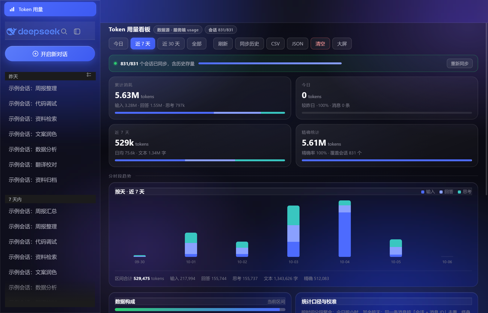
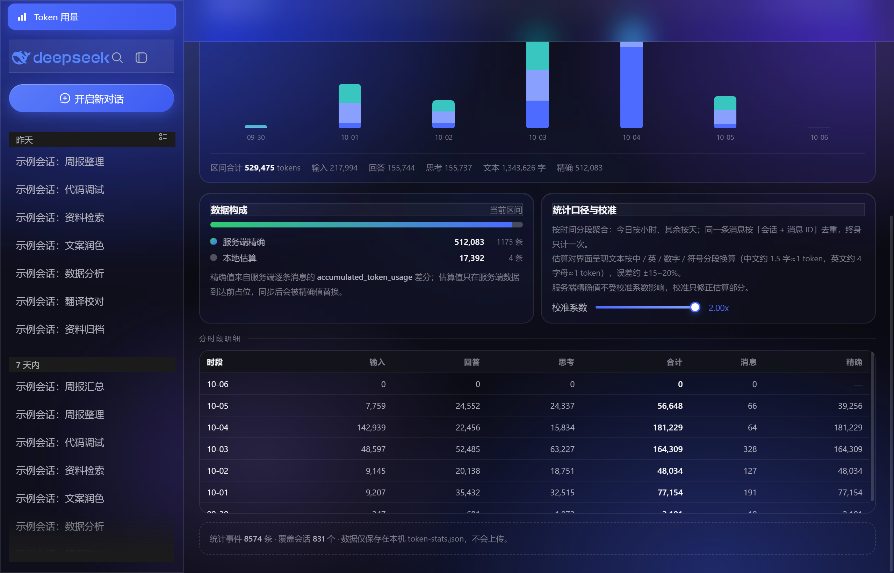

# deepseek-desktop

> DeepSeek 网页桌面封装 · **液态玻璃主题** · **本地 Token 用量看板**

一个基于 Electron 的 DeepSeek 网页桌面客户端。除了无边框窗口、原生标题栏、系统级右键菜单这些基础封装外，它有两件值得拿出来说的事：

1. **液态玻璃（Liquid Glass）外观** —— 全局毛玻璃材质 + 一层极慢流动的极光背景，深浅色自适应，透明度 / 流速可调；
2. **Token 用量看板** —— 按时间分时段聚合（今日按小时、其余按天），区分「服务端精确值」与「本地估算值」，支持历史存量会话全量回填、CSV / JSON 导出、估算系数校准。

**所有统计数据只保存在本机 `token-stats.json`，不上传任何地方。**





## 目录

- [一、功能特性](#一功能特性)
- [二、液态玻璃外观](#二液态玻璃外观)
- [三、快速开始](#三快速开始)
- [四、看板使用指南](#四看板使用指南)
- [五、数据文件](#五数据文件)
- [六、统计口径](#六统计口径)
- [七、隐私与安全](#七隐私与安全)
- [八、项目结构](#八项目结构)
- [九、开发与调试](#九开发与调试)
- [十、已知限制](#十已知限制)
- [十一、免责声明](#十一免责声明)
- [**实现原理详解**](#实现原理详解)（适合学习：三层架构、主世界注入、差分记账、回填队列、液态玻璃实现……）

---

## 一、功能特性

### 1.1 Token 用量看板

- **看板入口**：左侧栏底部的 **「Token 用量」** 按钮（柱状图图标）。点击后右侧内容区整体切换为看板；点击侧栏其它任意位置返回正常视图。
- **精确统计**：读取 `history_messages` 返回的 `accumulated_token_usage`，按消息做**差分**得到逐条精确 token，输入 / 思考 / 回答分列，精确率 100%。
- **本地估算**：界面呈现文本按中 / 英 / 数字 / 符号分段启发式估算，**只在没有精确值时兜底**，可用滑条校准（0.5x–2.0x，实时作用于估算部分）。
- **历史回填**：`fetch_page` 分页拉取全部会话 → 逐会话拉取全量历史，启动后自动执行、断点续传，同步条实时显示进度与当前会话。
- **增量采集**：活动会话每 15 秒轮询一次（单会话 20 秒去重），窗口失焦或标签页隐藏时不采集。
- **分段视图**：今日 / 近 7 天 / 近 30 天 / 全部。含分段柱状图、4 张统计卡、数据构成占比、口径说明与校准、分时段明细表。
- **导出**：CSV（每行带来源标签：`接口usage` / `服务端精确` / `估算`）、JSON 全量导出（含 `calib` 与 `meta`）、清空重置（二次点击确认）、大屏模式。
- **数据自检**：底部常驻「统计事件 N 条 · 覆盖会话 N 个 · 数据仅保存在本机」。

### 1.2 主题与体验

- **两套外观**：标准 / 液态玻璃，深浅色四种组合（标准深色、标准浅色、玻璃深色、玻璃浅色），跟随网页端原生 `body.light`。
- **思考展示模式**：完整 / 关键步骤 / 仅提示三种，作用于模型思考块的呈现。
- **无边框窗口**：自绘标题栏 + 拖拽区 + 原生 `titleBarOverlay` 图标，右键菜单为系统原生风格。
- **便携模式**：打包版登录态与统计数据固定在 exe 同级 `userdata/`，可随 U 盘移动。

---

## 二、液态玻璃外观

液态玻璃是这个项目在视觉上最花心思的部分，目标是：**毛玻璃质感 + 会呼吸的背景光晕，但绝不干扰阅读**。

### 2.1 效果构成

| 层 | 作用 | 实现 |
| --- | --- | --- |
| 极光背景层 `#cbx-aurora` | 页面最底层四团径向渐变光晕，缓慢平移缩放 | `position:fixed; inset:0; z-index:-1`，`@keyframes cbx-aurora-flow` |
| 页面底色 | 玻璃主题下 `html,body` 也叠四团固定径向渐变，光晕不随滚动消失 | `radial-gradient(...)` 组合 |
| 玻璃材质 | 卡片 / 弹窗 / 抽屉 / 气泡 / 代码块 / 开关等统一半透明 + 模糊 | `--glass-bg` + `backdrop-filter: blur(20px) saturate(170%)` |
| 描边高光 | 亮边模拟玻璃厚度 | `--glass-bd` 10% / `--glass-bd2` 16% 白色 |

### 2.2 你可以调的四个参数

设置面板 → **个性化**（与「语言」「通用设置」同级）：

| 设置项 | 选项 | 落地效果 |
| --- | --- | --- |
| 外观风格 | 标准 / **液态玻璃** | 切换整套 `THEME_GLASS*` 与 `THEME_STANDARD*` 变量 |
| 玻璃透明度 | 0–100%（默认 50%） | 换算成 `--glass-alpha`，越高越透出背景光晕 |
| 流动效果 | 开 / 关 | 关闭时 `body.cbx-flow-off` → 极光层 `animation:none` |
| 流动速度 | 慢 / 中 / 快 | 映射到 `--cbx-flow-dur`：**90s / 55s / 26s** 一个循环 |

透明度换算（深浅色不同，避免浅色下糊成一片）：

```js
// 暗色：0.02 ~ 0.18   浅色：0.26 ~ 0.66
const a = light ? Math.min(.66, .26 + alpha / 100 * .40)
                : Math.min(.18, .02 + alpha / 100 * .14);
```

设置存在 `localStorage`：`ds-codex-theme`、`ds-codex-glass-flow`、`ds-codex-glass-speed`、`ds-codex-glass-alpha`、`ds-codex-think-mode`。

### 2.3 三个「不打扰阅读」的细节

1. **滚动即暂停**：滚动时 `body.cbx-scrolling` → 极光 `animation-play-state:paused`，滚动结束继续，省 GPU 也避免视觉抖动；
2. **`will-change:transform`** 只给极光层，光晕平移走合成层，正文不参与；
3. **每帧只动 transform**：`translate3d(±1.8%) + scale(1.045)`，无颜色动画、无 `filter` 动画。

---

## 三、快速开始

```bash
npm install     # .npmrc 已内置 npmmirror 镜像（Electron / electron-builder 走国内源）
npm start       # 开发运行
npm run dist    # electron-builder 打包到 release/win-unpacked
```

- `npm start`（开发版）：userData 在系统 `%APPDATA%\deepseek-desktop`，便于调试时共用会话。
- 打包后的便携版：userData 固定为 **exe 同级 `userdata/` 目录**（随 U 盘移动，登录态与统计数据一致）。

应用标识：`productName = deepseek-desktop`，`appId = com.deepseek.desktop`。

---

## 四、看板使用指南

看板顶部工具条：

| 按钮 | 作用 |
| --- | --- |
| 今日 / 近 7 天 / 近 30 天 / 全部 | 切换统计区间；今日按小时分桶，其余按天 |
| 刷新 | 重新扫描当前界面消息、重绘看板 |
| 同步历史 | 手动触发历史存量全量回填（已同步则显示「重新同步」） |
| CSV / JSON | 导出到系统「下载」文件夹并在资源管理器中定位 |
| 清空 | 两次点击确认后清空本地统计（不影响会话数据） |
| 大屏 | 放大图表与卡片，退出大屏恢复 |

**校准系数**只修正估算值：`估算显示值 = round(原始估算 × calib)`，服务端精确值永远不乘系数。默认 1.00x。

---

## 五、数据文件

| 文件 | 说明 |
| --- | --- |
| `userdata/token-stats.json` | 全部用量事件与元数据（`events` / `meta.sessions` / `calib`） |
| `userdata/*` | 登录态、IndexedDB 等，请勿提交到仓库 |

保留策略：事件写入前自动裁剪 —— 超过 **1500 天** 的删除，总量超过 **60000** 条时保留最近的。

写入方式：先写 `token-stats.json.tmp` 再原子改名，避免断电产生半个 JSON。

---

## 六、统计口径

- **服务端精确值（推荐口径）**：同一条消息按 `会话 ID + 消息 ID` 去重（去重键 `h:sessionId:messageId[:T]`），终身只计一次；`accumulated_token_usage` 是会话内的**累计值**，对相邻消息做差分即该条消息的精确 token。
- **思考 / 回答拆分**：一条消息同时含思考与正文时，按两者的字符占比把 delta 拆成 `think` 与 `out`。
- **本地估算**：按字符类别分段（中文约 1.5 字 ≈ 1 token、英文 4 字母 ≈ 1、数字 3、空白 /10、标点 /2），误差约 ±15~20%。
- **估算被精确值替换**：估算事件带 `m:'e'`，同会话拿到精确历史后会删除时间窗内的估算事件，再写入精确事件。
- **接口 usage**：`usage` 字段单独归类为 `接口usage`，**不计入总量**，避免与逐条差分重复统计。
- 看板顶部「精确率」= 精确值 / (精确值 + 估算值)。

---

## 七、隐私与安全

- 仅在本机读取**你自己账号**的会话历史与 token 统计，全部落盘在本地 `token-stats.json`，不联网上报。
- 采集的鉴权头只保存在**内存**中（主进程变量），用于以同一身份调用历史接口，不写入磁盘、不外发。
- IPC 只暴露 4 个通道：`cbx-auth-get` / `cbx-tokens-load` / `cbx-tokens-save` / `cbx-tokens-export`。
- 仓库不含任何账号数据：`userdata/`、`app/`、`release/`、`*.log`、`debug-*`、`*.asar` 均已 gitignore。

---

## 八、项目结构

```
deepseek-desktop/
├── main.js          # 主进程：窗口、便携 userData、鉴权头捕获、统计文件 IPC、导出
├── preload.js       # 预加载：主题/液态玻璃、看板 UI、采集与回填、聚合渲染
├── assets/          # 图标与 logo
├── docs/            # README 截图
├── package.json     # productName / appId / 打包配置
├── .npmrc           # npmmirror 镜像
├── LICENSE          # MIT
└── userdata/        # 运行期生成（未入库）：token-stats.json、登录态
```

> `build.files` 只包含 `main.js`、`preload.js`、`assets/icon.ico`，**所有业务逻辑都内联在这两个文件里**，没有额外的运行时依赖。

---

## 九、开发与调试

- `node --check main.js && node --check preload.js`：语法自检（改完必跑）。
- `DS_DEBUG=1 npm start`：启用调试模式（更大的窗口、右键「检查元素」、日志写 `debug-log.txt`）。默认关闭。
- `DS_URL` 可覆盖启动地址（指向本地或测试环境）。
- 重新部署到已打包的便携版：把 `main.js` / `preload.js` / `package.json` / `assets/` 放进 staging 目录 → `asar pack` → 覆盖 `app/resources/app.asar` → 重启（`assets/` 必须在，否则图标丢失）。

---

## 十、已知限制

- 侧栏入口按钮的定位依赖页面结构：优先以侧栏底部账户块为锚点，找不到时回退到侧栏选择器；网页端改版可能需要调整 `tkLocate()`。
- 估算值基于**呈现文本**而非真实请求体，含图片、文件引用的消息只能估个大概。
- 精确值依赖服务端 `accumulated_token_usage` 字段；若接口变更，回填与差分会失效（看板会退化为估算值）。
- 大量会话（>1000）首次回填需要一定时间，可在同步条查看进度，支持断点续传。

---

## 十一、免责声明

- 本项目为第三方实现，**非 DeepSeek 官方产品，与 DeepSeek 无任何关联**。
- 使用本项目需自行遵守 DeepSeek 的服务条款与相关法律法规。

## License

[MIT](LICENSE) © stone2010

---

---

# 实现原理详解

> 这一节写给想动手改、或者想学 Electron 注入与数据可视化的读者。按「架构 → 采集 → 记账 → 聚合 → 呈现 → 打包」的顺序展开。

## 1. 总体架构：三层，各管一段

```
┌────────────────────────────────────────────────────────┐
│ 主进程 main.js                                          │
│  · BrowserWindow / 无边框 / 便携 userData                │
│  · webRequest.onBeforeSendHeaders → 内存里存鉴权头        │
│  · IPC：读写 token-stats.json、导出文件到下载目录          │
└──────────────▲─────────────────────────▲───────────────┘
               │ contextBridge (4 个 IPC) │
┌──────────────┴─────────────────────────┴───────────────┐
│ 预加载层 preload.js（isolated world，有 Node 能力）        │
│  · 主题与液态玻璃：注入 <style>、写 CSS 变量               │
│  · 看板：DOM 构建、聚合计算、事件绑定                       │
│  · 采集编排：回填队列、轮询、去重、持久化调度               │
└──────────────▲─────────────────────────────────────────┘
               │ 执行一段【主世界】字符串 (see §2)
┌──────────────┴─────────────────────────────────────────┐
│ 页面主世界（DeepSeek 网页自己的 JS 环境）                   │
│  · hook window.fetch / XHR → 解析响应里的 token           │
│  · 只能把数据通过 window.codexUsage.report(json) 抛回来    │
└────────────────────────────────────────────────────────┘
```

关键配置：

```js
webPreferences: {
  preload: path.join(__dirname, 'preload.js'),
  contextIsolation: true,   // 隔离：页面拿不到 preload 的内部变量
  nodeIntegration: false,
  sandbox: false,           // preload 需要 require('electron') / fs
}
```

## 2. 为什么要「主世界注入」

`contextIsolation: true` 是安全上的正确选择，但它带来一个直接后果：**preload 与页面互相看不见对方**。

- 看板需要的 token 数据，产生在页面自己的 `fetch` / `XMLHttpRequest` 流程里；
- preload 里写 `window.fetch = ...` 改的是 isolated world，页面代码根本不会调用到。

解法是 `tkInstallUsageHook()`：把一段**纯字符串**交给页面主世界去执行（通过渲染层的执行通道），在页面自己的环境里打补丁，并约定一个单向回传通道：

```js
// 页面主世界里运行
if (window.__cbxUsageHooked) return 'dup';   // 幂等，只装一次
window.__cbxUsageHooked = 1;

function report(obj) {
  var j = (typeof obj === 'string') ? obj : JSON.stringify(obj);
  if (window.codexUsage && window.codexUsage.report) {
    window.codexUsage.report(j);   // 走 contextBridge 暴露的唯一入口
    return true;
  }
  return false;
}
```

preload 侧只暴露一个能力、收一个字符串：

```js
contextBridge.exposeInMainWorld('codexUsage', {
  report: (json) => { if (typeof tkUsageCb === 'function') tkUsageCb(String(json)); },
});
```

这就是**能力受限的单向数据通道**：页面只能「递交数据」，拿不到文件系统、拿不到 IPC。

## 3. 网络层采集：三类消息，三种形状

hook 同时覆盖 `fetch` 与 `XMLHttpRequest`，按 URL / 内容分三类：

| 类型 | 触发条件 | 归一化后的 payload |
| --- | --- | --- |
| 历史响应 `hist` | URL 含 `history_messages` | `{type:'hist', sid, title, sat, sup, cur, msgs:[{id,role,at,atu,tc,mc}]}` |
| 流式 usage | 响应文本含 `prompt_tokens` / `completion_tokens` | `{p, c, t}` → 记为 `接口usage` |
| 其它 | — | 不采集 |

两个值得注意的细节：

1. **只在需要时解析**：先用 `indexOf` 判断文本里有没有 `prompt_tokens` / `"usage"`，没有就直接跳过，避免为每个静态资源 `JSON.parse`；
2. **响应要 `clone()`**：`fetch` 的 body 只能读一次，必须先克隆再异步读文本，否则会把页面自己的请求读挂。

`compactHist()` 做的是**压缩**：把整页历史响应压缩成「每条消息的 id / 角色 / 时间 / 累计 token / 思考字符数 / 正文字符数」，几十 KB 的响应在 preload 里只留几百字节。

## 4. 精确记账：差分 + 去重

服务端给的 `accumulated_token_usage` 是**会话内累计值**，不是单条消息的值。所以：

```js
let acc = 0;
for (const m of msgs) {
  const before = acc;
  if (m.atu > acc) acc = m.atu;   // 单调不减
  const delta = acc - before;      // 这条消息真实消耗
  if (delta <= 0) continue;        // 重复或无增量 → 跳过
  // 再按思考/正文字符占比把 delta 拆成 think 与 out
}
```

拆分规则：

- 有思考有正文 → `think = round(delta * tc/(tc+mc))`，`out = delta - think`
- 只有思考 → 全记 `think`；否则全记 `out`（用户消息记 `in`）

**去重**是第二道闸，去重键：

```
h:<sessionId>:<messageId>        // 普通消息
h:<sessionId>:<messageId>:T      // 同一条里的思考部分
```

`tkStore.seen` 是一个 `Set`，事件入队前查一次，终身只计一次 —— 这就是「同一条消息无论刷新多少次都只算一遍」的来源。

**估算被替换**：估算事件带 `m:'e'`；拿到某会话的精确历史后，先把该会话 `wall` 时间窗内的估算事件删掉（`removed`），再写入精确事件（`added`），最后 `rebuildSeen()`。看板上「本地估算」条数因此只会越来越少。

## 5. 历史回填：游标分页 + 队列 + 断点续传

```
fetch_page?lte_cursor.updated_at=<上一页最后一条>   ← 会话清单（游标分页）
        ↓ 逐个会话
history_messages?chat_session_id=<uuid>            ← 全量消息
        ↓ compact + 差分去重
   token-stats.json
```

`tkBackfill` 是一个带状态的队列：

- `boot(force)`：60 秒内不重复启动；`listed` 表示清单是否已拉完；
- `list()`：递归拉 `fetch_page`，把每页最后一条的 `updated_at` 作为下一页游标，每页之间 `setTimeout 220ms` 做限速；
- `runQueue(ids)`：逐会话拉历史，`total / covered` 就是同步条上的进度；
- `enqueue(sid)`：运行中收到新会话 → 进 `pending`，本轮结束后补跑；
- `cur`：当前正在处理的会话前 8 位，显示在同步条上。

**断点续传**靠 `meta.sessions[c8]`：每个会话记 `{max: 最大消息ID, wall: 上次写入时间}`，重启后已覆盖的会话可以快速跳过。

实时侧 `tkPollTick()`（每 15 秒）负责「正在聊的这个会话」：从 URL 里解析 `chat_session_id`，同一会话 20 秒内不重复拉，拿回来直接走 `tkIngestHist()` —— 所以活跃会话几乎实时进账。

## 6. 实时采集与估算兜底

`tkCollector` 盯的是**界面上正在渲染的消息**（虚拟列表）：

- `setInterval 1600ms` 扫描 + `MutationObserver`（700ms 防抖）双保险；
- 用 `WeakMap` 记住每个可见节点的「指纹」（文本长度 + 子节点数），指纹不变不重复计；
- 窗口失焦（`document.hidden`）时不扫描，省电也避免脏数据。

这些事件的 `m` 是 `'e'`（estimate），token 数来自 `tkEstimate()`：

```js
t += Math.max(1, Math.round(chars / 1.5));   // 中文：1.5 字 ≈ 1 token
t += Math.max(1, Math.round(chars / 4));     // 英文：4 字母 ≈ 1 token
// 数字 /3、空白 /10、标点 /2
```

**校准**在读取时生效，而不是写入时：

```js
function tkTok(e) { return e.m === 'a' ? e.n : Math.round(e.n * tkCalib()); }
//                     精确值：原样      估算值：乘系数
```

所以拖动校准滑条只是改显示，原始估算值永远保留在文件里，可以随时改回来。

## 7. 聚合、分桶与看板渲染

纯函数式：**扫描一遍 events，累加进一个桶**。

```js
function tkSum(start, end) {          // 区间合计
  for (const e of evs) {
    if (e.t < start || e.t >= end) continue;
    const n = tkTok(e);
    if (e.m === 'a' && e.c === 'api') { /* 接口usage：单独计，不进总量 */ continue; }
    if (e.m === 'a') { /* 精确：xi/xo/xt，xN++ */ }
    else { /* 估算：in/out/think，eN++ */ }
    acc.ch += e.ch || 0;              // 字符数（文本量）
  }
}

function tkBuckets(tab) {
  const mode = tab === 'today' ? 'hour' : 'day';   // 今日按小时，其余按天
  // 先按时间轴生成 keys（含空桶），保证柱状图 x 轴连续
  // 再把 events 灌进 Map<key, bucket>
}
```

要点：

- **先造空桶再填数** —— 没有 token 的小时/天也会画出 0 高度的格子，时间轴不断裂；
- **三种口径分列**：`xi/xo/xt`（精确）、`in/out/think`（估算）、`apiIn/apiOut`（接口 usage），互不混算；
- 渲染是 `tkBuildHTML()` 拼 HTML 字符串 → `tkRender()` 写进 `#cbx-token-pane`，事件用 `tkBindPane()` 一次性委托绑定，重绘不丢监听；
- `tkLocate()` 找两样东西：**面板宿主**（右侧内容列，消息滚动区的父容器）与**侧栏锚点**（优先账户块，回退侧栏选择器），然后 `tkActivate()` 用 `display:none` 把原有内容藏起来、把看板挂进去 —— 所以不需要改动网页端任何源码。

## 8. 持久化与 IPC：只有四个通道

```js
// preload → main
ipcRenderer.invoke('cbx-auth-get')      // 读内存里的鉴权头（不落盘）
ipcRenderer.invoke('cbx-tokens-load')   // 读 token-stats.json
ipcRenderer.invoke('cbx-tokens-save', data)   // 原子写：tmp → rename
ipcRenderer.invoke('cbx-tokens-export', {name, content}) // 写到下载目录并定位
```

主进程侧的鉴权捕获（**数据只进内存**）：

```js
session.defaultSession.webRequest.onBeforeSendHeaders(
  { urls: ['*://chat.deepseek.com/*'] },
  (details, callback) => {
    if (authKey && h[authKey]) CBX_AUTH = pickAllowlistedHeaders(h); // 内存变量
    callback({ requestHeaders: details.requestHeaders });             // 不修改请求
  }
);
```

只挑白名单里的头（`authorization`、`x-device-id`、`x-client-*` …），主进程从不把它们写进任何文件。

`cbx-tokens-save` 的原子写是为了防「写一半断电」：先 `token-stats.json.tmp`，成功后 `rename`，失败则回退直写并清理 tmp。

## 9. 液态玻璃是怎么实现的

### 9.1 一个固定的极光层

```css
#cbx-aurora{
  position: fixed; inset: 0; z-index: -1; pointer-events: none;
  background:
    radial-gradient(880px 600px at 18% 10%, rgba(96,118,255,.30), transparent 60%),
    radial-gradient(720px 500px at 90% 14%, rgba(140,110,255,.20), transparent 58%),
    radial-gradient(820px 580px at 76% 94%, rgba(70,100,255,.22), transparent 60%),
    radial-gradient(520px 400px at 32% 78%, rgba(160,130,255,.12), transparent 62%);
  animation: cbx-aurora-flow var(--cbx-flow-dur,55s) ease-in-out infinite alternate;
  will-change: transform;
}
@keyframes cbx-aurora-flow{
  0%   { transform: translate3d(0,0,0) scale(1); }
  33%  { transform: translate3d(-1.8%,1.1%,0) scale(1.045); }
  66%  { transform: translate3d(1.5%,-1.1%,0) scale(1.025); }
  100% { transform: translate3d(0,0,0) scale(1); }
}
body.cbx-flow-off #cbx-aurora{ animation: none; }
body.cbx-scrolling #cbx-aurora{ animation-play-state: paused; }
```

`z-index:-1` 让它永远在内容之下、又在 `html` 背景之上 —— 正文区域是透明的，光晕才透得上来。

### 9.2 玻璃材质 token

```css
:root{
  --glass-bg:  rgba(255,255,255, var(--glass-alpha, .055));
  --glass-bg2: rgba(255,255,255, var(--glass-alpha2,.085));
  --glass-bd:  rgba(255,255,255,.10);
  --glass-bd2: rgba(255,255,255,.16);
  --glass-blur: blur(20px) saturate(170%);
}
```

透明度不是各处写死，而是**一个 CSS 变量由 JS 统一换算**（公式见 §2.2），深浅色用不同区间，`--glass-alpha2` 再派生一层更亮的（暗色 ×1.6、浅色 ×1.12），保证卡片有前后层次。

### 9.3 覆盖原站：属性选择器 + `!important`

网页端类名是压缩过的（`.dc04ec1d` 这种），逐个选择器维护不现实。所以玻璃化走**属性匹配**：

```css
[class*="modal" i], [class*="drawer" i], [class*="popover" i],
[class*="panel" i], [class*="card" i], [class*="bubble" i], ... {
  background: var(--glass-bg) !important;
  backdrop-filter: var(--glass-blur) !important;
  border: 1px solid var(--glass-bd) !important;
}
```

`i` 标志表示大小写不敏感；`!important` 是必需的 —— 网页端大量内联样式，不加就压不住。代价是调试时要清楚每条规则的优先级，因此所有覆盖都集中在 `TK_CSS` / 主题常量里，而不是散落在各处。

### 9.4 四套主题怎么组织

```js
const THEME_STANDARD = `...`;      // 标准深色
const THEME_STANDARD_LIGHT / THEME_GLASS / THEME_GLASS_LIGHT
```

切换 = 往 `<head>` 里一个固定 `#cbx-theme` 的 `<style>` 写入对应字符串；浅色判断直接复用网页端的 `body.light`，**不自己维护第二套真值**。`applyGlassSettings()` 则只负责把 localStorage 里的三个偏好换算成 CSS 变量。

## 10. 打包与便携化

```js
if (app.isPackaged) {
  // 便携：userData 固定在 exe 同级 userdata/，换电脑登录态一致
  app.setPath('userData', path.join(path.dirname(app.getPath('exe')), 'userdata'));
} else {
  app.setPath('userData', path.join(app.getPath('appData'), 'deepseek-desktop'));
}
```

`package.json` 的 `build.files` 只有 `main.js`、`preload.js`、`assets/icon.ico` —— 意味着**新增功能必须内联进这两个文件**，这是这个项目最反直觉、也最容易踩的坑（忘了带 `assets/` 打出来的包会缺图标，文件体积也能立刻看出，正常包约 462KB，漏 assets 只有 161KB）。

## 11. 已知限制与取舍

| 限制 | 原因 / 取舍 |
| --- | --- |
| 依赖网页端类名与 URL 结构 | 注入式方案无法避免；集中在 `tkLocate()` / hook 里便于适配 |
| 估算基于呈现文本 | 请求体拿不到（也不该去截），用展示文本是隐私与精度的折中 |
| 精确值依赖 `accumulated_token_usage` | 服务端字段变更会导致差分失效，届时退化为估算 |
| `!important` 覆盖较重 | 与网页端内联样式对抗的必要手段，代价是局部调试成本 |
| 单文件、无测试框架 | 这是桌面封装而非库；以 `node --check` + 实机点检兜底 |

改完代码记得：`node --check main.js && node --check preload.js`，然后重打包 asar 并重启应用验证。
